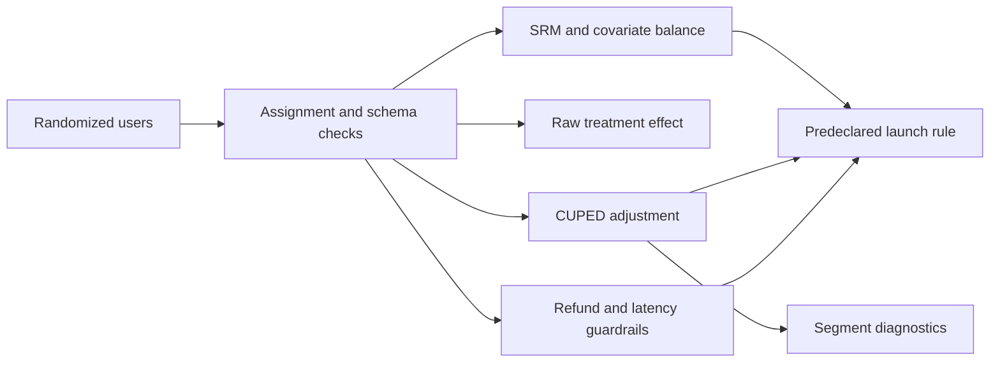

# Experimentation Decision Engine

[](https://github.com/sagarmandavkar-UX/experimentation-decision-engine/actions/workflows/tests.yml)


A decision-oriented A/B testing framework that connects statistical evidence to an explicit launch policy. It includes power analysis, sample-ratio mismatch, covariate balance, raw and CUPED-adjusted estimates, segment diagnostics, refund and latency guardrails, and minimum-business-effect sensitivity.

> The shipped experiment is seeded synthetic data. Its decision demonstrates the workflow rather than a real product launch.

## Executive result

In the demonstration, CUPED reduces outcome variance by roughly **46%**. The adjusted revenue lift is about **$1.45 per user** with a **95% CI of $0.80 to $2.09**. Assignment diagnostics and guardrails pass the default policy, resulting in a `LAUNCH` decision at a $1 minimum business effect.

## Decision policy

A launch requires all of the following:

1. CUPED-adjusted 95% confidence interval excludes zero.
2. Point estimate meets the predeclared minimum business effect.
3. Refund-rate deterioration remains below one percentage point.
4. Latency deterioration remains below 25 ms.
5. Sample-ratio mismatch p-value remains above 0.01.

## What this project demonstrates

- Two-arm randomized experiment analysis at user grain.
- Sample-size planning from MDE, variance, alpha, and power.
- CUPED variance reduction using a pre-treatment covariate.
- Sample-ratio mismatch and standardized balance checks.
- Raw, adjusted, and segment-level confidence intervals.
- Guardrail metrics participating in the decision.
- Threshold-sensitivity analysis.
- Reproducible decision artifact and Streamlit dashboard.

## Architecture



## Repository structure

```text
├── experiment.py            # generator, power, inference, decision policy
├── app.py                   # experiment decision dashboard
├── docs/                    # methodology, data contract, memo
├── outputs/                 # decision and threshold sensitivity
├── test_project.py
├── Dockerfile
├── Makefile
└── requirements.txt
```

## Quick start

```bash
git clone https://github.com/sagarmandavkar-UX/experimentation-decision-engine.git
cd experimentation-decision-engine
python -m venv .venv
source .venv/bin/activate
make setup
make analyze
make test
make dashboard
```

## Input contract

One row per randomized user with `treatment`, `segment`, `pre_spend`, `revenue`, `refund`, and `latency_ms`. Users with zero activity after assignment must remain in the dataset for intent-to-treat analysis.

## Analytical guardrails

Segment estimates are explicitly diagnostic and are not promoted into a subgroup launch rule after observing results. Production use should add an experiment registry, exclusion audit, novelty window, sequential-testing policy, and telemetry-quality checks.

## Portfolio talking points

- Implemented CUPED and demonstrated the relationship between variance reduction and decision precision.
- Built an executable launch rule combining statistical, business, and operational criteria.
- Added assignment diagnostics and guardrails that prevent a significant p-value from becoming the entire decision.

See [Methodology](docs/METHODOLOGY.md), [Data dictionary](docs/DATA_DICTIONARY.md), and [Executive memo](docs/EXECUTIVE_MEMO.md).
